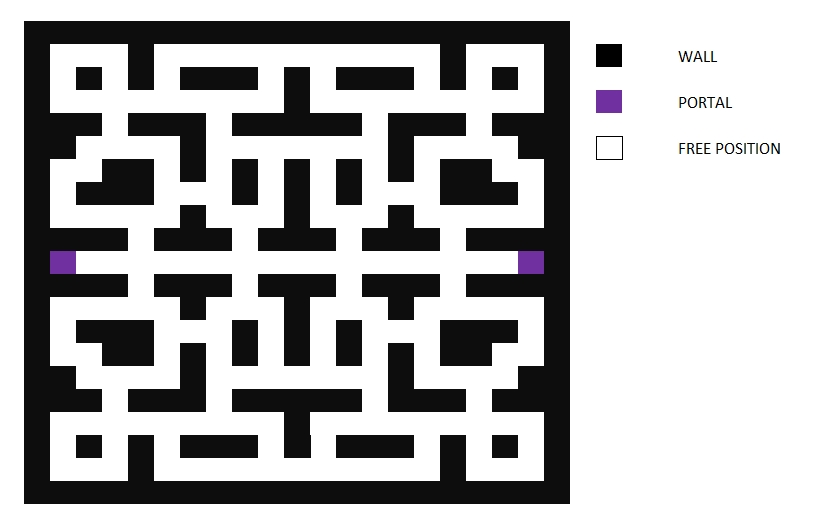
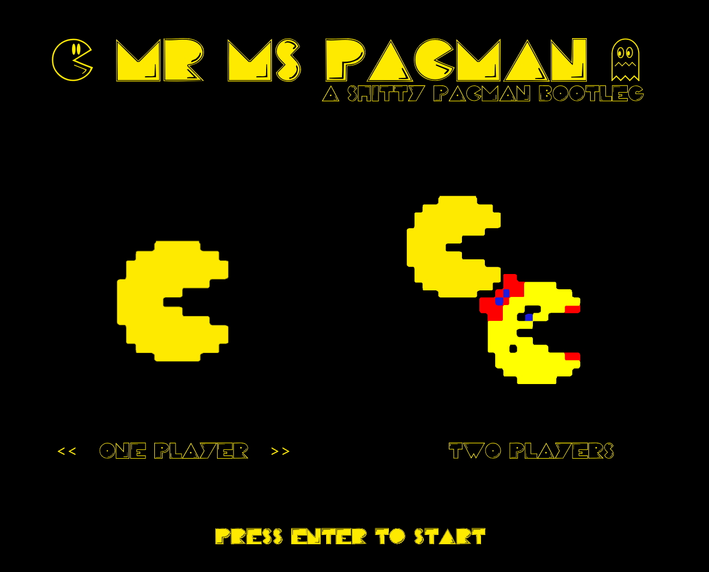
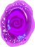
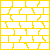
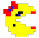
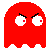
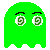
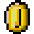
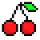

# PacMan - TP Integrador POO

## Obetivos 📒

### 4/11/2020 📅

- Terminar el juego (**jajaj**)
- Tests:
    - Come banana -> puntos aumentan (**HECHO**)
    - Come banana y come enemigo -> puntos aumentan (**HECHO**)
    - Intena comer enemigo pero muere -> pierde una vida (**HECHO**)
- Comportamiento:
    - Los fantasmas se comportan de manera distinta (**HECHO**)
- Muros:
    - Generarlos de una mejor manera (**HECHO - MEJORABLE**)
    - Evitar las colecciones (**HECHO - MEJORABLE**)
- Movimientos:
    - Consultar si la proxima posición tiene un objeto atravesable (**HECHO**)
- Más de 2 personajes (skins) (**HECHO**)
- Más enemigos (**HECHO**)
- Portales (**HECHO**)

### 22/10/2020 📅

- Obstáculos/muros en  el medio (además de los bordes) (**HECHO**)
- Enemigos, que se mueven siempre de la misma forma (**HECHO**)
- Comer cocos e ir sumando puntos (**HECHO**)
- 1 power-up (el que quieran) (**HECHO**)

## Mapa 🗺️

## Mecánicas 🤓
 
- ⚙️Menu de selección de cantidad de personajes y gestor de los marcos para el juego!(**HECHO - MEJORABLE**)
-    Portales (**HECHO**)
-  Muros no traspasables
-   Personajes:
    -  Barra de salud para personajes (MAXIMO 5 VIDAS)
    - 👼 Personajes tienen 5s de inmunidad cada vez que spawnea en el mapa, para evitar las autodeath (**HECHO**)
-  Fantasmas (enemigos):
    - Modelar con clases e instanciar (**HECHO - MEJORABLE**)
    - 👣Tipos de movimiento:
        -  Explorador: Aleatorio evitando los muros y la posicion anterior (**HECHO**)
        -  Cazador: Buscar al jugador mas cercano (**HECHO**)
        -  Stalker: Busca a un jugador fijo, de éste perder, busca a otro (**HECHO**)
        -  Tímido: siempre busca alejarse de todos los personajes (**HECHO**)
        -  Tonto: Nunca puede decidirse a quien seguir(**HECHO**)
    - ☠️Al morir reaparecen con otro nombre, actitud y aporta diferente puntaje (**HECHO**)
- 🍽️Alimentos (powerups y puntos):
    - Modeladas con clases (que heredan de otra clase principal (**HECHO -  MEJORABLE**)
    - ❄️Cada fruta tiene su propio cooldown para reaparecer (**HECHO**)
    - Otorgan puntos y/o algún poder: (**HECHO - MEJORABLE**)
        -  Monedas: Sin efecto (**HECHO**)
        -  Cerezas: letalidad (**HECHO**)
        -  Bananas: letalidad prolongada (**HECHO**)
        -  Corazones: aumentar vida (**HECHO**)
        -  Pizzas: aumentar vida y letalidad (**HECHO**)
        -  Chillys: hacen aparecer una bola de fuego que envuelve al personaje (**HECHO**)
            - Bola de fuego: todo lo que alcance su radio, es autoamticamente ingerido por el personaje que la invocó
## Integrantes 😁
- Da Ruos, Ailén
- Escalante, Leandro
- Obezzi, Matías
- Troisi, Bruno